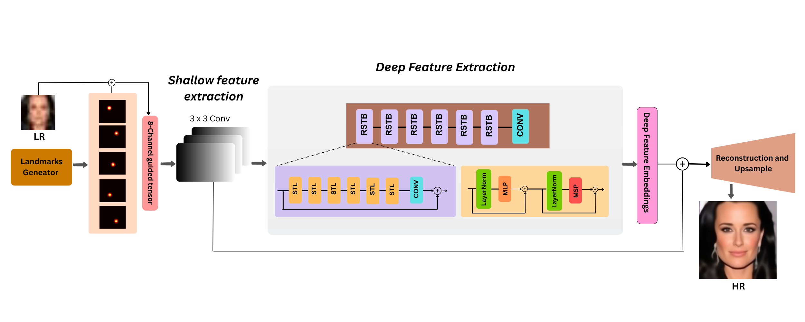

# 🚀 SwinFSR: Landmark-Guided Swin Transformer for Face Super-Resolution

SwinFSR is a landmark-guided Swin Transformer model designed for **4× and 8× face super-resolution**.  
It integrates facial landmark heatmaps with a hierarchical Swin Transformer to reconstruct identity-consistent high-resolution facial images under severe degradation.

---

## 🔥 Key Features
- **Landmark-Guided Input:** 8-channel input (RGB + 5 Gaussian landmark heatmaps)  
- **Transformer Backbone:** Swin Transformer with 6 Residual Swin Transformer Blocks (RSTBs)  
- **Multi-Scale SR:** Supports 4× (32→128) and 8× (16→128)  
- **Identity Preservation:** Strong geometric and structural consistency  
- **Evaluation Metrics:** PSNR (Y), SSIM (Y), LPIPS (RGB)

---

## 🧩 Methodology Overview
SwinFSR fuses facial geometry (landmark heatmaps) with transformer-based local–global feature modeling.  
A shallow convolution extracts initial features, and stacked RSTBs enhance facial structure and texture.  
PixelShuffle upsampling reconstructs the high-resolution output.

---

## 🧱 Methodology Diagram

---

## 🖼 Visual Results
8× Face Super-Resolution (16 → 128)

---

4× Face Super-Resolution (32 → 128)

## 🚀 Training
4× Super-Resolution
- **python train_evaluate_swinfsr.py --opt options/swinfsr/train_swinfsr_sr_celeba_x4.json**

8× Super-Resolution
- **python train_evaluate_swinfsr.py --opt options/swinfsr/train_swinfsr-x8.json**

---

## Training performs:

- **Automatic checkpoint saving**

- **Testing at specified intervals**

- **Logging PSNR, SSIM, LPIPS**

- **Automatic bicubic comparison**

- **Optional saving of SR visual outputs**

## 🔍 Testing / Inference

- **python train_evaluate_swinfsr.py --opt option/swinfsr/train_swinfsr_x4.json --save_results**

Results are stored in

- **superresolution/images**

You may also test on any custom LR image folder.

## 📊 Evaluation Metrics
SwinFSR uses standard metrics in the face SR literature:**

- **PSNR (Y-channel)**

- **SSIM (Y-channel)**

- **LPIPS (RGB) using AlexNet backbone**

👨‍💻 Author

## Habiba Kausar
- **Landmark-Guided Face Super-Resolution (2025)**
